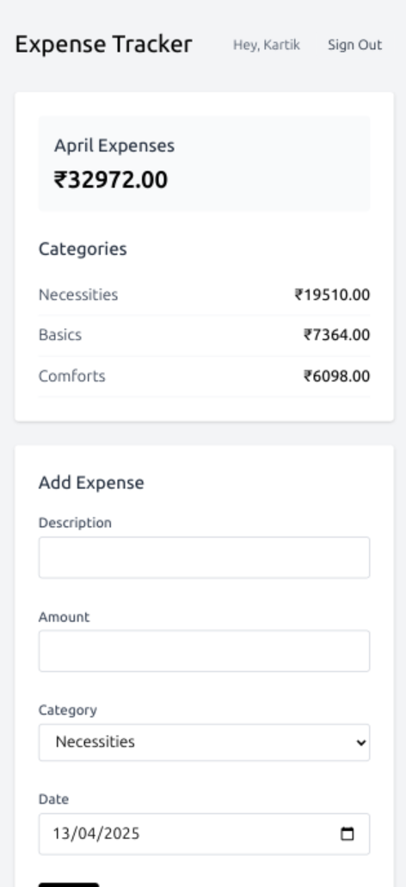
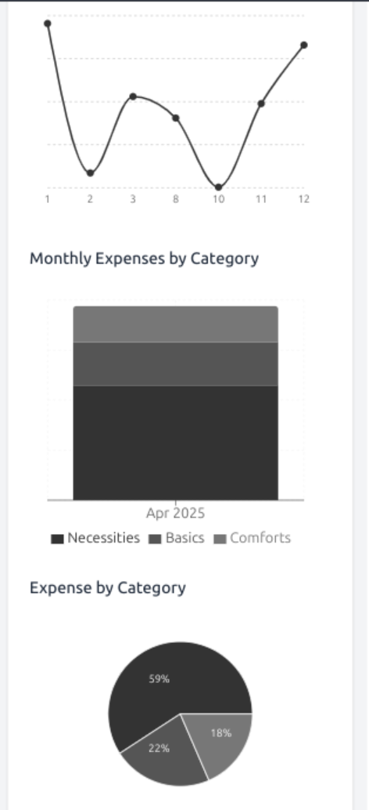
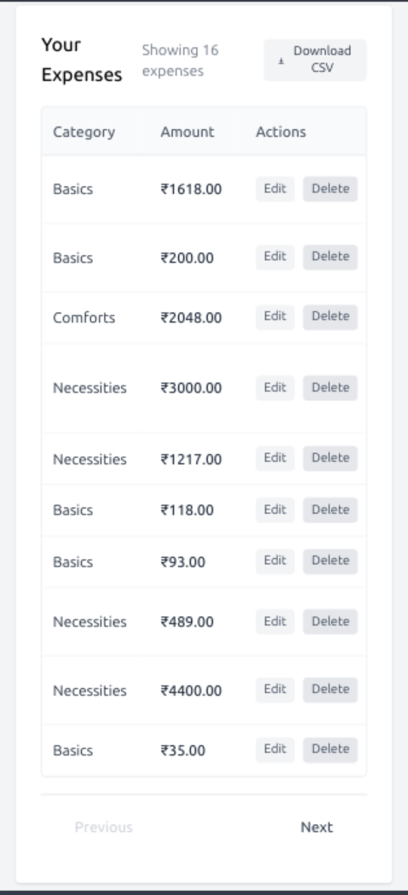

# Expense Tracker

[Live Link](https://expense.kartikpapney.xyz)

A secure, real-time expense tracking application built with Next.js and Firebase.


## Features

-   **Google Authentication**: Secure user login
-   **Real-time Updates**: Instantly see changes as you add or modify expenses
-   **Interactive Charts**: Visualize spending patterns with category breakdowns
-   **Responsive Design**: Fully functional on mobile, tablet, and desktop
-   **Data Security**: Firebase security rules ensure users can only access their own data

## Tech Stack

-   **Frontend**: Next.js with TypeScript
-   **State Management**: React Hooks
-   **Styling**: Tailwind CSS
-   **Database & Auth**: Firebase (Firestore + Authentication)
-   **Deployment**: Vercel

## Screenshots

<div style="display: flex; justify-content: space-between;">
  
  
  
</div>

## Getting Started

```bash
# Clone the repository
git clone https://github.com/yourusername/expense-tracker.git

# Install dependencies
npm install

# Set up environment variables
cp .env.example .env.local

# Run the development server
npm run dev
```

